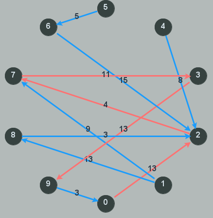
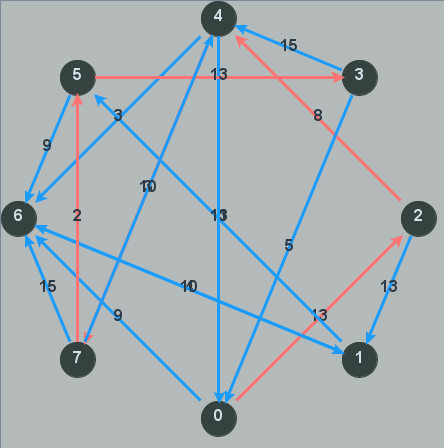
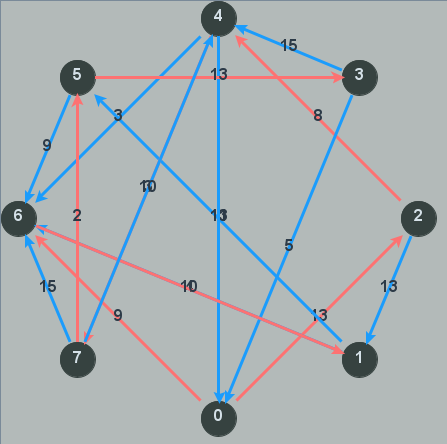
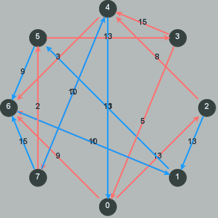
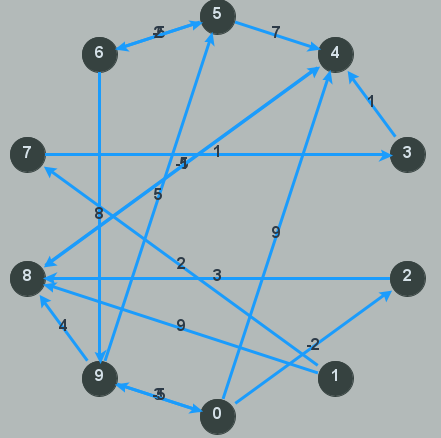
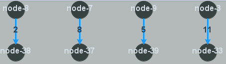

[![Build][build-shield]][build-url]
[![Version][version-shield]][version-url]
[![Language][language-shield]][language-url]

# Graphs

<br />
<div align="center">
<p>
<a href="https://mlhoutel.github.io/Graphs/">
<strong>Browse the docs »</strong>
</a>
</p>
</div>
  
## About The Project

This repository is used during the practice classes of "Graphe et algorithmes" course in IMT Atlantique.

This is a standard maven project so please use the according import option in your IDE (IntelliJ IDEA or Eclipse).

### Built With

- **[javadoc](https://docs.oracle.com/javase/8/docs/technotes/tools/windows/javadoc.html)
- **[jgraphx](https://github.com/vlsi/jgraphx-publish)
- **[setup java](https://github.com/actions/setup-java)

### Exemple

#### Code

```java
int[][] mat = GraphTools.generateValuedGraphData(10, true, false, true, false, 100001);
GraphTools.afficherMatrix(mat);

DirectedValuedGraph al = new DirectedValuedGraph(mat);

int From = 0;
int To = 9;

try {
    List<DirectedNode> path = ShortestPath(al, al.getNodes().get(From), al.getNodes().get(To));

    System.out.println(path);
    BinaryHeapEdge<DirectedNode> binh = new BinaryHeapEdge<DirectedNode>();

    for (int i = 1; i < path.size(); i++) {
        binh.insert(path.get(i - 1), path.get(i),0);
    }

    DrawDirectedCoveringTree.Display(al, binh);
} catch (Exception e) {
    e.printStackTrace();
}
```
#### Screenshots

<div align="center">

<p>Dijkstra</p>
</div>

<div align="center">

<p>Bellman</p>
</div>

<div align="center">

<p>Prim</p>
</div>

<div align="center">

<p>Kruskal</p>
</div>

<div align="center">

<p>Circular</p>
</div>

<div align="center">

<p>BinaryHeap</p>
</div>

<div align="center">

<p>BinaryHeapEdge</p>
</div>


### Build docs

Generate javadoc with `mvn javadoc:javadoc`

## Authors

- Raphael Painter
- Maël Lhoutelier

[build-shield]: https://img.shields.io/github/workflow/status/mlhoutel/Graphs/publish/master?style=flat-square
[build-url]: https://github.com/mlhoutel/Graphs/blob/main/.github/workflows/main.yml
[version-shield]: https://img.shields.io/badge/version-1.0.0-orange?style=flat-square
[version-url]: https://github.com/mlhoutel/Graphs/blob/main/pom.xml
[language-shield]: https://img.shields.io/github/languages/top/mlhoutel/Graphs?style=flat-square
[language-url]: https://github.com/mlhoutel/Graphs/search?l=java
