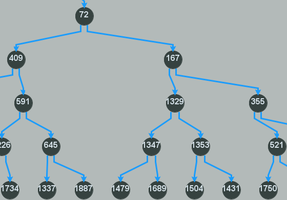

[![Build][build-shield]][build-url]
[![Version][version-shield]][version-url]
[![Language][language-shield]][language-url]

# Graph-Framework

<br />
<div align="center">
<a href="https://mlhoutel.github.io/Graphs/">

</a>
  
<p align="center">
<a href="https://mlhoutel.github.io/Graphs/">
<strong>Browse the docs »</strong>
</a>
</p>
</div>
  
## About The Project

This repository is used during the practice classes of "Graphe et algorithmes" course in IMT Atlantique.

This is a standard maven project so please use the according import option in your IDE (IntelliJ IDEA or Eclipse).

### Built With

Graphs made with https://github.com/vlsi/jgraphx-publish

### Exemple

#### Code

```java
int[][] mat = GraphTools.generateValuedGraphData(10, true, false, true, false, 100001);
GraphTools.afficherMatrix(mat);

DirectedValuedGraph al = new DirectedValuedGraph(mat);

int From = 0;
int To = 9;

try {
    List<DirectedNode> path = ShortestPath(al, al.getNodes().get(From), al.getNodes().get(To));

    System.out.println(path);
    BinaryHeapEdge<DirectedNode> binh = new BinaryHeapEdge<DirectedNode>();

    for (int i = 1; i < path.size(); i++) {
        binh.insert(path.get(i - 1), path.get(i),0);
    }

    DrawDirectedCoveringTree.Display(al, binh);
} catch (Exception e) {
    e.printStackTrace();
}
```
#### Screenshots


<p align="center">Dijkstra</p>


<p align="center">Bellman</p>


<p align="center">Prim</p>


<p align="center">Kruskal</p>


<p align="center">Circular</p>


<p align="center">BinaryHeap</p>


<p align="center">BinaryHeapEdge</p>


### Build docs

Generate javadoc with `mvn javadoc:javadoc`

## Authors

- Raphael Painter
- Maël Lhoutelier

[build-shield]: https://img.shields.io/github/workflow/status/mlhoutel/Graphs/publish/main?style=flat-square
[build-url]: https://github.com/mlhoutel/Graphs/blob/main/.github/workflows/docs.yml
[version-shield]: https://img.shields.io/badge/version-1.0.0-orange?style=flat-square
[version-url]: https://github.com/mlhoutel/Graphs/blob/main/CMakeLists.txt
[language-shield]: https://img.shields.io/github/languages/top/mlhoutel/Graphs?style=flat-square
[language-url]: https://github.com/mlhoutel/Graphs/search?l=java
